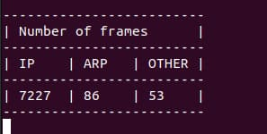

# Frame counter

Count number of frames of different types.



## Compilation

```bash
$ cd libbpf/src
$ make
$ cd ../../
$ mkdir build
$ cmake -S . -B ./build
$ cmake --build ./build
```

## Usage

```bash
$ sudo ./build/frame_counter
```
